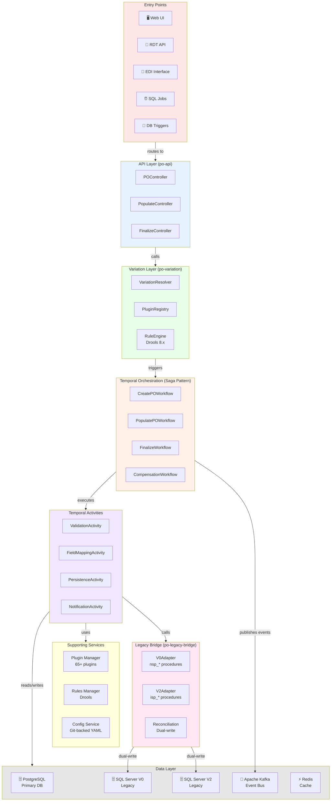
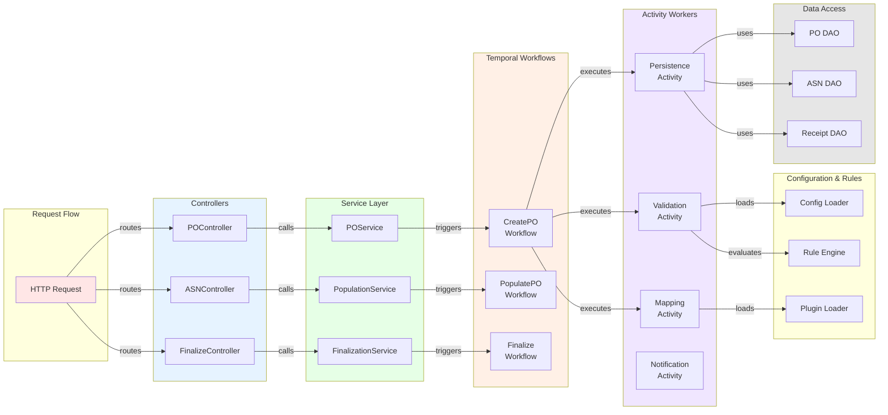
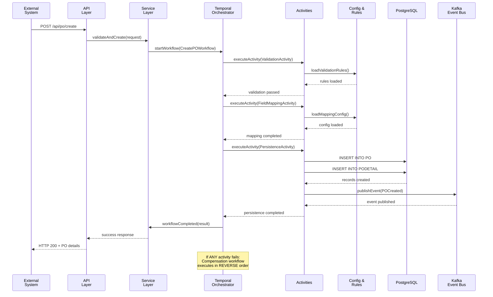
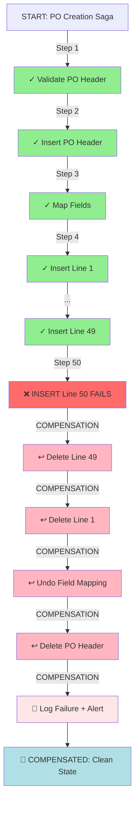
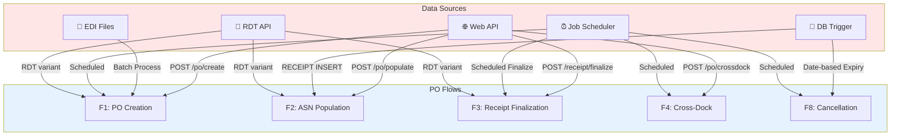
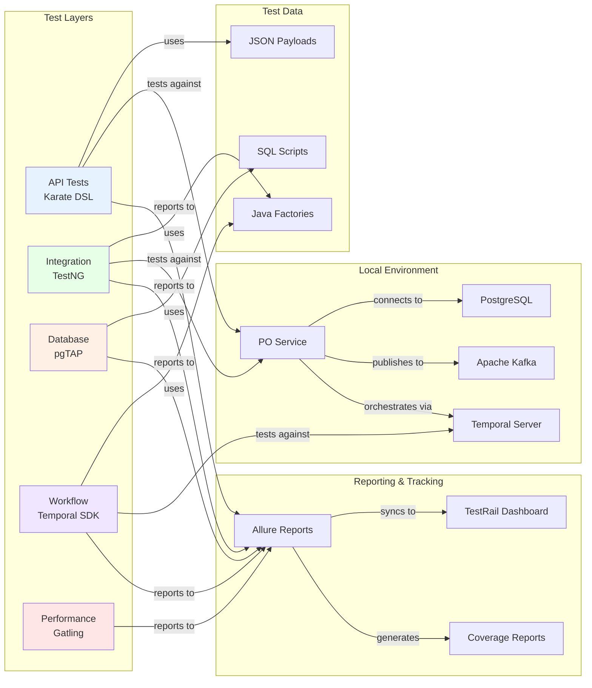

# Haiku: PO Module E2E Automation Testing Plan

> **Status:** Streamlined Testing Framework (Haiku Version)  
> **Version:** 1.0 Compact  
> **Date:** 2026-05-06  
> **Target:** 100% Legacy SP Migration to Microservices  
> **Coverage Goal:** 250+ test cases | 10 flows | 5 entry points  

---

## Quick Reference

### 10 PO Flows Summary

| Flow | Entry Points | Test Cases | Priority | Status |
|------|--------------|-----------|----------|--------|
| F1: PO Creation | API, EDI, Job | 11 | CRITICAL | ⏳ |
| F2: ASN Population | API, Trigger | 9 | CRITICAL | ⏳ |
| F3: Receipt Finalization | API, Job | 9 | CRITICAL | ⏳ |
| F4: Cross-Dock | API, Job | 8 | HIGH | ⏳ |
| F5: Line Swap | API | 7 | MEDIUM | ⏳ |
| F6: Line Split | API | 9 | MEDIUM | ⏳ |
| F7: Archival | Job | 7 | LOW | ⏳ |
| F8: Cancellation | Job | 7 | LOW | ⏳ |
| F9: Deletion | API, Trigger | 7 | MEDIUM | ⏳ |
| F10: Compensation | All | 11 | CRITICAL | ⏳ |
| **TOTAL** | | **~250** | | |

---

## Test Case Distribution (250 tests)

```
Happy Path:        50 tests (20%) ✅
Unhappy Path:      75 tests (30%) ❌
Edge Cases:        50 tests (20%) 🔸
Error Cases:       50 tests (20%) ⚠️
Compensation:      25 tests (10%) 🔄
```

---

## 5 Entry Points Coverage

| Entry Point | Flows | Test Cases | Status |
|-------------|-------|-----------|--------|
| **API Gateway** | F1, F2, F4, F5, F6, F9 | 60 | ⏳ |
| **EDI Interface** | F1 | 25 | ⏳ |
| **DB Triggers** | F2, F8 | 20 | ⏳ |
| **SQL Jobs** | F1, F3, F7, F8 | 80 | ⏳ |
| **RDT API** | F1, F2, F3 | 65 | ⏳ |

---

## Architecture Diagrams

### 1. Complete System Architecture



### 2. Component Architecture & Dependencies



### 3. PO Flow: Entry Point to Database



### 4. Saga Pattern: Compensation Flow



### 5. Entry Points to Flows Mapping



### 6. Test Automation Architecture



---

## Test Automation Stack

```
API Layer       → Karate DSL (Gherkin-based)
Integration     → TestNG + Spring Test
Database        → pgTAP (PostgreSQL)
Workflows       → Temporal Java SDK
Performance     → Gatling / JMeter
Reporting       → Allure + ExtentReports
Tracking        → TestRail / Zephyr
Local Env       → Docker Compose
```

---

## Flow-Specific Test Cases

### Flow 1: PO Creation (11 TCs)

```
F1-TC01: Valid PO (1 line)                    ✅ Happy
F1-TC02: Multi-line PO (50 lines)             ✅ Happy
F1-TC03: Duplicate PO                         ❌ Unhappy
F1-TC04: Missing required field               ❌ Unhappy
F1-TC05: Max lines boundary (501)             🔸 Edge
F1-TC06: Unicode characters in address        🔸 Edge
F1-TC07: DB connection timeout                ⚠️ Error
F1-TC08: Race condition (concurrent)          ⚠️ Error
F1-TC09: Line insert fails (line 10/50)       🔄 Compensation
F1-TC10: Valid EDI file parsing               ✅ Happy (EDI)
F1-TC11: Malformed EDI format                 ⚠️ Error (EDI)
```

### Flow 2: ASN Population (9 TCs)

```
F2-TC01: Full population (100%)               ✅ Happy
F2-TC02: Field mapping with defaults          ✅ Happy
F2-TC03: ASN already linked                   ❌ Unhappy
F2-TC04: Invalid PO status                    ❌ Unhappy
F2-TC05: Qty mismatch (ASN > PO)              🔸 Edge
F2-TC06: Multi-client mapping                 🔸 Edge
F2-TC07: Plugin timeout (>60s)                ⚠️ Error
F2-TC08: Auto-populate on RECEIPT INSERT      ✅ Trigger
F2-TC09: Rollback mapping failure             🔄 Compensation
```

### Flow 3: Receipt Finalization (9 TCs)

```
F3-TC01: Full receipt (100%)                  ✅ Happy
F3-TC02: Partial receipt (80%)                ✅ Happy
F3-TC03: Over-receipt (120%)                  ❌ Unhappy
F3-TC04: Missing lottable                     ❌ Unhappy
F3-TC05: Lottable defaulting                  🔸 Edge
F3-TC06: Cross-dock auto-fulfill              🔸 Edge
F3-TC07: Location full (no space)             ⚠️ Error
F3-TC08: Scheduled batch finalization         ✅ Job
F3-TC09: Rollback inventory creation          🔄 Compensation
```

### Flows 4-10: Summary

```
F4 (Cross-Dock):     8 TCs  → 3 Happy + 2 Edge + 2 Error + 1 Comp
F5 (Line Swap):      7 TCs  → 2 Happy + 2 Edge + 2 Error + 1 Comp
F6 (Line Split):     9 TCs  → 3 Happy + 3 Edge + 2 Error + 1 Comp
F7 (Archival):       7 TCs  → 2 Happy + 2 Edge + 2 Error + 1 Comp
F8 (Cancellation):   7 TCs  → 2 Happy + 2 Edge + 2 Error + 1 Comp
F9 (Deletion):       7 TCs  → 2 Happy + 2 Edge + 2 Error + 1 Comp
F10 (Compensation):  11 TCs → 3 Happy + 2 Edge + 3 Error + 3 Comp
```

---

## Error Coverage Matrix

| Error Type | HTTP Status | Test Cases | Handling |
|-----------|-----------|-----------|----------|
| **Validation** | 400 | 15 | Reject + log |
| **Conflict** | 409 | 12 | Retry + alert |
| **Business Logic** | 422 | 18 | Validate + reject |
| **System** | 500, 503 | 15 | Retry + compensate |
| **Timeout** | 504 | 10 | Retry + alert |

---

## Edge Cases (12 Covered)

```
1.  Max lines (501)           → Reject
2.  Unicode characters        → Sanitize
3.  Boundary qty (105%)        → Accept
4.  Negative qty              → Reject
5.  Zero qty                  → Reject
6.  Null optional field       → NULL
7.  Empty string              → NULL
8.  Date boundary (TODAY)     → Accept
9.  Expired date              → Cancel
10. Multi-timezone (KR+SG+IN) → Apply regional rules
11. Large PO ($10M)           → Process normally
12. Concurrent operations     → No corruption
```

---

## Test Data Strategy

### Prerequisites (Setup Once)

```sql
-- Storer Master
INSERT INTO STORERMAST (StorerKey, StorerName, CountryCode)
VALUES ('TEST-STORER-001', 'Nike Korea', 'KR'),
       ('TEST-STORER-002', 'H&M India', 'IN'),
       ('TEST-STORER-003', 'Adidas Singapore', 'SG');

-- Facility Master
INSERT INTO FACILITYMASTER (FacilityKey, StorerKey, FacilityName)
VALUES ('TEST-FAC-001', 'TEST-STORER-001', 'Warehouse 1'),
       ('TEST-FAC-002', 'TEST-STORER-002', 'Warehouse 2');

-- Location Master
INSERT INTO LOCATIONMAST (LocationKey, FacilityKey, LocationZone)
VALUES ('LOC-TEST-001', 'TEST-FAC-001', 'A'),
       ('LOC-TEST-002', 'TEST-FAC-001', 'B'),
       ('LOC-TEST-003', 'TEST-FAC-001', 'C');  -- Full (edge case)

-- SKU Master
INSERT INTO SKULIST (SKU, StorerKey, UOM, LotFlag)
VALUES ('TEST-SKU-001', 'TEST-STORER-001', 'CS', 1),
       ('TEST-SKU-002', 'TEST-STORER-001', 'EA', 1),
       ('TEST-SKU-999', 'TEST-STORER-001', 'PC', 0);  -- Invalid
```

### Test Data by Flow

```
Flow 1: po-create-001.json (simple) ... po-create-edi-001.edi (EDI variant)
Flow 2: po-pop-001.json (full) ... po-pop-conflict-001.json (conflict)
Flow 3: receipt-fin-001.json ... receipt-fin-xdock-001.json (cross-dock)
Flow 4-9: [Similar pattern per flow]
Flow 10: po-create-comp-001.json (compensation)
```

---

## Compensation Flows (Saga Pattern)

### PO Creation Saga

```
Step 1: Validate PO        ✓
Step 2: Insert PO Header   ✓
Step 3: Map Fields         ✓
Step 4-50: Insert Lines    ✓ → Line 50 FAILS ❌

Compensation:
- Delete PODETAIL (lines 1-50)
- Delete PO (header)
- Log failure + alert
→ Clean state
```

### ASN Population Saga

```
Step 1: Validate PO        ✓
Step 2: Validate ASN       ✓
Step 3: Map Fields         ✓
Step 4: Update ASN         ✓ → Plugin timeout ❌

Compensation:
- Revert ASN to prev state
- Undo field mapping
- Retry with backoff
```

### Receipt Finalization Saga

```
Step 1: Validate Receipt   ✓
Step 2: Create LOTXLOCXID  ✓
Step 3: Update Inventory   ✓
Step 4: Update PO Status   ✓ → DB error ❌

Compensation:
- Delete LOTXLOCXID
- Revert inventory
- Revert PO status
- Alert user
```

---

## Local Environment Setup

### Docker Compose (Quick)

```bash
cd po-test-automation

# Start environment
docker-compose up -d

# Verify readiness
docker-compose ps

# Seed test data
docker exec po-test-postgres psql -U testuser -d wms_po_test \
  -f /docker-entrypoint-initdb.d/prerequisites.sql

# Run tests
mvn clean test

# View reports
allure serve target/allure-results
```

---

## Test Execution Commands

```bash
# All tests
mvn clean test

# Specific flow
mvn test -Dtest=*PO\*Test

# API tests only (Karate)
mvn test -Dtest=KarateRunner

# Integration tests
mvn test -Dtest=*IntegrationTest

# Compensation tests
mvn test -Dtest=*CompensationTest

# With coverage
mvn clean test jacoco:report

# Entry point tests
mvn test -Dentry.point=API
mvn test -Dentry.point=EDI
mvn test -Dentry.point=JOB
mvn test -Dentry.point=TRIGGER
mvn test -Dentry.point=RDT
```

---

## CI/CD Pipeline

### GitHub Actions

```yaml
on: push, pull_request, schedule (nightly)

Jobs:
  1. API Tests (Karate)
  2. Integration Tests (TestNG)
  3. Database Tests (pgTAP)
  4. Workflow Tests (Temporal)
  5. Compensation Tests
  6. Performance Tests (Gatling)
  7. Reporting (Allure + TestRail)
  8. Cleanup
```

---

## Coverage Metrics & KPIs

| Metric | Target | Current | Status |
|--------|--------|---------|--------|
| **Code Coverage** | >80% lines | - | ⏳ |
| **Branch Coverage** | >75% | - | ⏳ |
| **Test Case Coverage** | 250 tests | - | ⏳ |
| **Entry Point Coverage** | 5/5 (100%) | - | ⏳ |
| **Scenario Coverage** | All types | - | ⏳ |
| **Pass Rate** | 100% | - | ⏳ |

---

## Implementation Timeline (9 Weeks)

| Week | Phase | Tasks | Owner |
|------|-------|-------|-------|
| 1-2 | Foundation | Docker, Karate, TestNG setup | DevOps/QA |
| 3-4 | Critical Flows | F1, F2, F3 (29 tests) | QA Lead |
| 5 | Extended Flows | F4, F5, F6 (24 tests) | QA |
| 6 | Lifecycle Flows | F7, F8, F9 (21 tests) | QA |
| 7 | Compensation | F10 (11 tests) + errors (50 tests) | QA |
| 8 | CI/CD & Reports | GitHub Actions + Allure + TestRail | DevOps |
| 9 | Validation | Performance, chaos, go-live readiness | Tech Lead |

---

## File Structure

```
po-test-automation/
├── src/test/
│   ├── java/
│   │   ├── integration/      (Flow tests)
│   │   ├── temporal/         (Workflow tests)
│   │   └── factory/          (Test data)
│   └── resources/features/
│       ├── flows/            (Karate features)
│       ├── compensation/
│       ├── error-cases/
│       └── edge-cases/
│
├── test-data/
│   ├── sql/                  (Seeding scripts)
│   └── json/                 (API payloads)
│
├── local-environment/
│   ├── docker-compose.yml
│   └── db-setup/
│
├── ci-cd/
│   └── .github/workflows/
│
├── scripts/
│   ├── setup-local-env.sh
│   ├── run-all-tests.sh
│   └── generate-reports.sh
│
└── test-tracker/
    ├── po-test-tracker.xlsx
    └── test-execution-report.html
```

---

## Quick Start (5 Steps)

```bash
# 1. Clone & navigate
git clone <repo>
cd po-test-automation

# 2. Setup local environment
./scripts/setup-local-env.sh

# 3. Run tests
mvn clean test

# 4. View results
allure serve target/allure-results

# 5. Upload to TestRail
./scripts/upload-to-testrail.sh
```

---

## Best Practices

✅ **DO**
- Dual-write during migration (compare outputs)
- Chaos engineering (inject failures)
- Data reconciliation (daily)
- Production-scale testing (1M+ POs)
- Regression testing (post-hotfix)

❌ **DON'T**
- Skip edge cases
- Test only happy path
- Manual testing
- Ignore timeouts
- Skip monitoring

---

## Success Criteria

Before go-live, verify:

- [ ] All 250 tests: 100% PASSED
- [ ] 5/5 entry points working
- [ ] 10/10 flows tested
- [ ] Compensation verified
- [ ] Performance meets SLA
- [ ] Zero data loss
- [ ] Audit trail complete
- [ ] Rollback plan tested

---

## Key Contacts

| Role | Owner | Email |
|------|-------|-------|
| QA Lead | TBD | - |
| DevOps | TBD | - |
| Tech Lead | TBD | - |
| Product Owner | TBD | - |

---

## References

- [Full Testing Plan](./PO_E2E_Automation_Testing_Plan.md)
- [Flow Diagrams](../drawio/)
- [Architecture](./PO_Modernization_Architecture.md)
- [Legacy SP Catalog](./../docs/sql/)

---

**Version:** 1.0 Compact | **Last Updated:** 2026-05-06 | **Status:** Ready for Implementation
